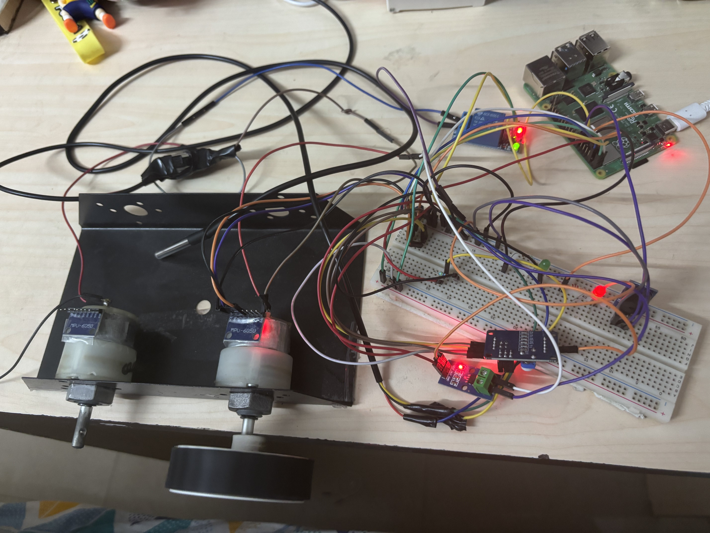
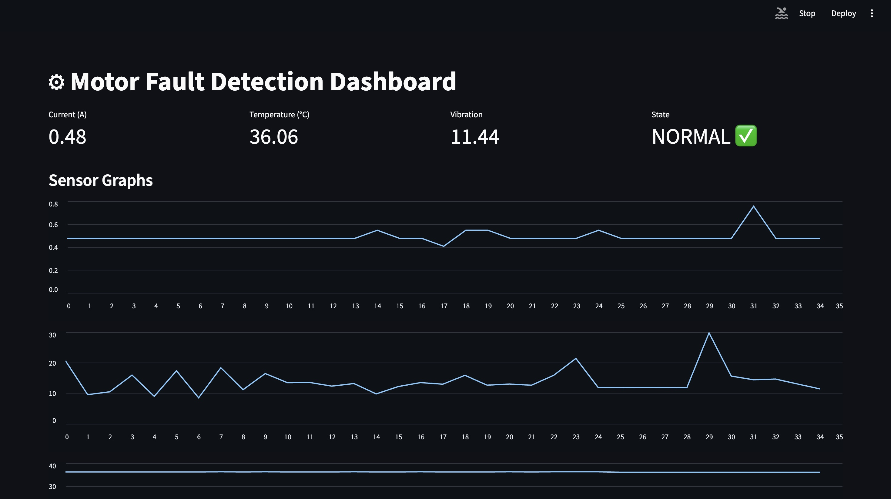
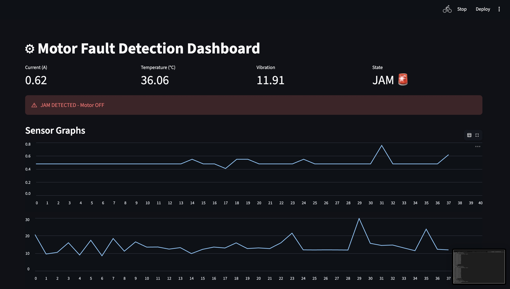
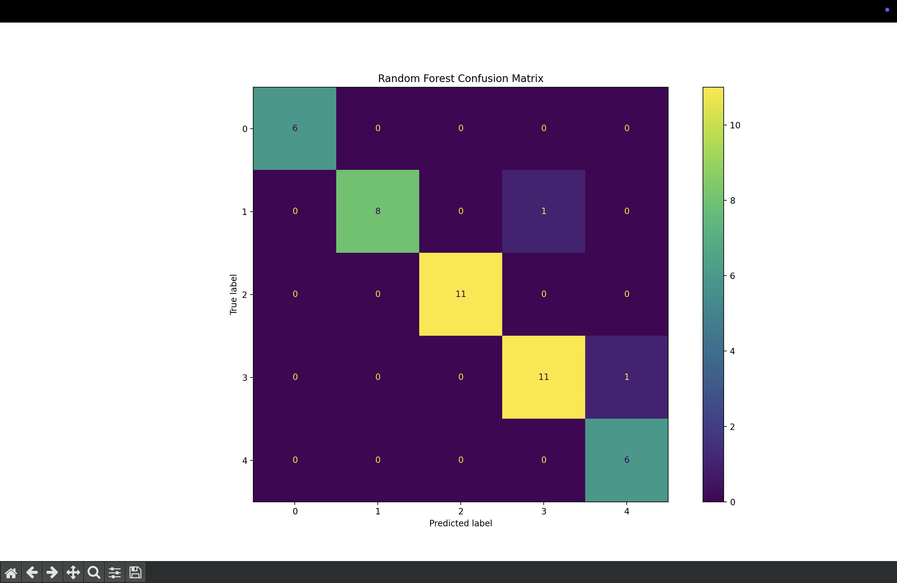

# Industrial-Iot-motor-fault-detection
Industrial IoT-based motor fault detection system using sensor fusion and hybrid ML classification for real-time monitoring and automated protection.
## 📄 Project Report

Detailed documentation of the system design, circuit diagrams, and implementation is available here:

👉 [View Full Report](docs/Project_Report.pdf)

## 🧠 System Setup

## 📊 Dashboard

### ✅ Normal Operation

### ⚠️ Fault Detected

## 📊 Model Evaluation

### Confusion Matrix

